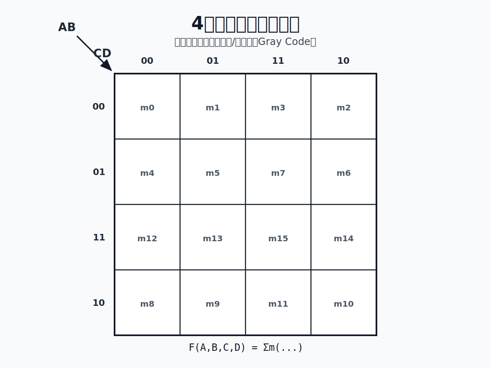

---
title: Karnaugh Map
date: 2026-04-21 15:33:21
tags: [digital-logic]
category: University
---
> 卡诺图是一种将逻辑关系通过几何图形来表示的方法。

卡诺图能够将逻辑函数以图形化的方式表达出来

其有一定规律，可以用来简化逻辑函数。

基本画法如下

1. 对于 \\(n\\) 个变量，有 \\(2^{n}\\) 个单元格。
2. 相邻的单元格之间只有一位不同，也就是按``循环码``取值。

## 逻辑相邻 

逻辑相邻的概念就是指在卡诺图中，两个单元格如果在几何位置上相邻（包括边界相连），则它们对应的最小项在逻辑上是相邻的，即它们的二进制表示只有一位不同。因此可以凭借卡诺图快速判断逻辑相邻关系。

**因为卡诺图是按照循环码排列的，所以逻辑相邻的项在几何位置上也是相邻的，这是由逻辑相邻的定义决定的**

## 变量卡诺图中最小项合并规律

只要逻辑相邻的项，都能够合并，但对合并的数量有要求，必须是 \\(2^{n}\\) 个，且最后可以消去 \\(n\\) 个变量,但只能呈正方形或者长方形。

## 卡诺图对于逻辑函数

在函数的每一个乘积处填上1，其余处填写0以用卡诺图表示出逻辑函数，同时可以使用卡诺图结合最小合并规则有效化简逻辑函数。

